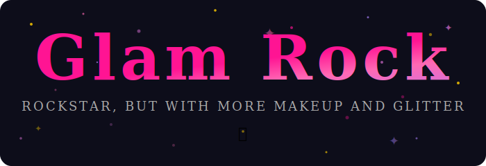

# Do you wanna get rocked?

This is **GlamRock**, a fork of [Rockstar](https://github.com/RockstarLang/rockstar) — an esoteric programming language whose syntax is inspired by the lyrics to 80s hard rock and heavy metal songs.

GlamRock extends Rockstar with practical language features while keeping every lyric singable.



# GlamRock Extensions 💎

These features are GlamRock additions, not part of standard Rockstar.

### Modules (`channel` / `light`)

Split your programs across files and control what's visible.

**math_module.rock**
```rockstar
The Pi is 3.14159
Add takes X and Y
Give back X with Y

Light The Pi and Add
```

**main.rock**
```rockstar
Channel Math Module
Shout Add taking 3, 4

Channel Math Module's The Pi
Shout The Pi
```

- `Light` marks variables or functions as exported (aliases: `ignite`, `shine`, `beacon`)
- `Channel Module` imports all exports into scope (alias: `bring`)
- `Channel Module's Export` or `Channel Export from Module` for selective imports
- Modules execute in isolation — no global leakage
- Circular imports are detected and rejected
- Full docs: [Modules](https://glamrock.dev/docs/13-modules)

# What's Here

Rockstar has three main components:

* `/Starship` contains the Starship interpreter for Rockstar, built in C# and .NET
* `/cm-lang-rockstar` contains the CodeMirror editor used on the Rockstar website
* `/codewithrockstar.com` contains the GlamRock website (glamrock.dev), docs and examples

### Building Rockstar

To build the Starship engine, you'll need the .NET 9 SDK

```dotnetcli
git clone https://github.com/RockstarLang/rockstar.git
cd rockstar
dotnet workload install wasm-tools
dotnet build ./Starship/Starship.sln
dotnet test ./Starship/
```

To build a Rockstar native binary on Linux, you'll need `gcc` installed, and then:

```
git clone https://github.com/RockstarLang/rockstar.git
cd rockstar
dotnet publish ./Starship/Rockstar -o binaries -c Release
```

That'll create a standalone binary executable in `binaries/rockstar`.

The `glamrock.dev` website is built with Jekyll and hosted on GitHub Pages.

The embedded Rockstar interpreter is the Starship engine compiled to run on web assembly:

```dotnetcli
dotnet build ./Starship/Starship.sln
dotnet publish ./Starship/Rockstar.Wasm -o glamrock.dev/wasm/ -c Debug
```

### Building with GitHub Actions

Building glamrock.dev works like this:

**build-rockstar-2.0**
- runs on Linux
- Builds the parser and interpreter
- Runs the test suite
- Uploads artifacts for:
	- Linux native binary
	- WASM interpreter for the website

**build-windows-binary**
* builds the Rockstar windows binary

**build-macos-binary**
* builds the macOS binary

**release-rockstar-engine**
* creates the GitHub release from the latest binaries

 **build-and-deploy-website**
* Downloads the Rockstar WASM binary
* builds the CodeMirror editor
* Builds the Jekyll site
* Deploys the site to GitHub Pages
### Debug/Dev Mode Setup

In dev mode, I use symbolic directory links between the various parts of the project. Rebuilding the .NET solution will rebuild the WASM interpreter, which Jekyll can see as `/wasm/**`, and trigger a site rebuild, and all the Rockstar code examples are part of both the `Rockstar.Test` .NET test suite project and the `glamrock.dev` site:

```
> cd glamrock.dev
> mklink /d wasm ..\Starship\Rockstar.Wasm\bin\Debug\net8.0-browser
> mklink /d examples ..\Starship\Rockstar.Test\programs\examples
```

```
glamrock.dev
  /wasm --> [ /Starship/Rockstar.Wasm/bin/Debug/net8.0-browser ]
  /examples --> [ /Starship/Rockstar.Test/programs/examples ]
  /index.html
  /example.md
  /js
 	/rockstar-editor.js (from codemirror)
```

